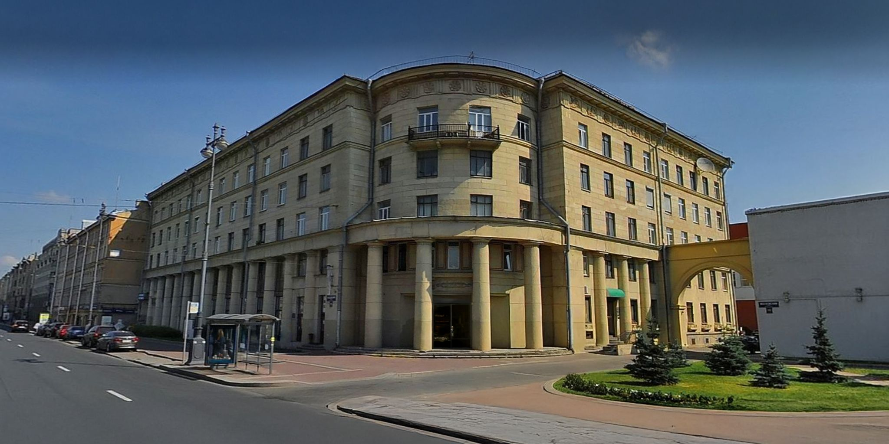
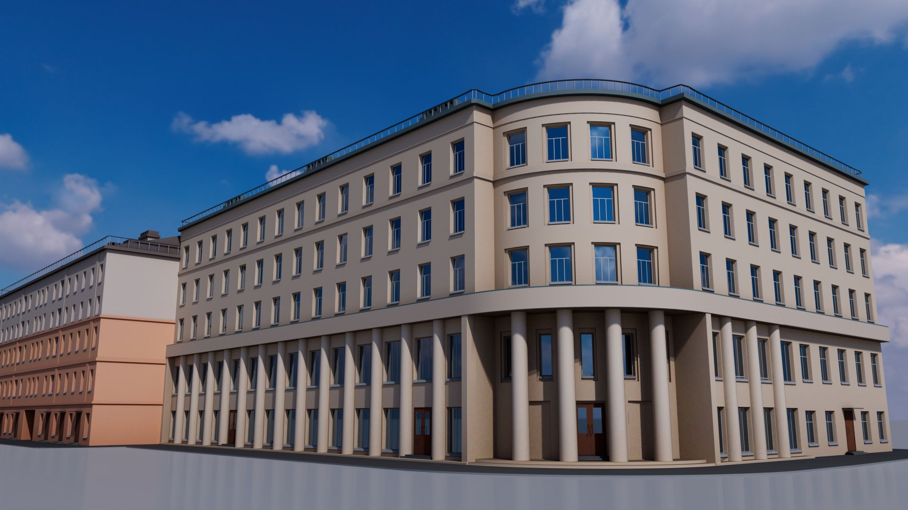
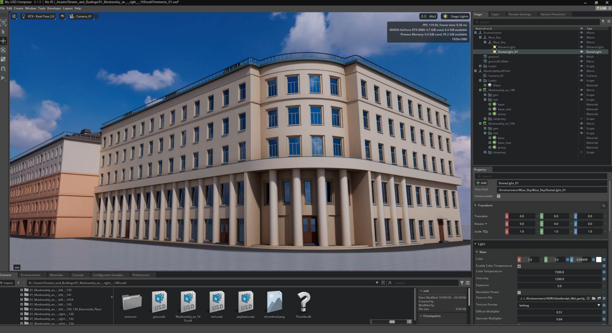

# Case 01: Moskovsky Av (Urban Monitoring Digital Twin)

> [!WARNING]
> **Work in Progress:** This project is currently under active development. Some links and assets may be placeholders.

---

> **Role:** L1 Digital Twin (Urban Monitoring)
> **Stack:** Houdini, Omniverse (USD/Python), Jira Integration

---

## 📋 Project Overview

This repository showcases a prototype **Urban Digital Twin (Level L1)** focused on real-time monitoring and visualisation of urban infrastructure. The case study centres on Moskovsky Avenue 150, demonstrating how procedural workflows and real-time 3D environments can transform traditional city planning and operations.

**Key Use Case:**
The digital twin integrates live transport telemetry to display **real-time bus arrival information** via HUD overlays positioned above "smart" bus stops. This exemplifies how L1 Digital Twins enable one-way data visualisation for operational awareness without requiring bidirectional control systems.

**Project Focus:**

- **Large-Scale Architectural Scenes:** Optimised workflows for handling complex urban environments
- **Procedural Approach:** Houdini-based generation enabling rapid iteration and scalability
- **Smart Urban Fabric:** Integration of IoT-like data streams with 3D spatial context

---

## 🎯 Technical Highlights

*This setup demonstrates an **L1 Digital Twin (Monitoring)**, focusing on one-way data visualisation rather than bidirectional control.*

- **Houdini Proceduralism:** City block generation with optimised USD export pipelines.
- **USD Composition:** Layered architecture (`mesh_`, `mat_`) for real-time Omniverse performance.
- **Custom Extensions:** Python-based visualisation of real-time telemetry (Bus Arrivals) on 3D geometry.

## 👁️ Visual Proof: Moskovsky Av. 150

*Evolution of a Digital Twin: From original reference to procedural generation and final Omniverse integration.*

| Original Reference | Houdini Procedural Render | Omniverse Digital Twin |
| :--- | :--- | :--- |
|  |  |  |
| *Real-world urban context* | *Procedural geometry & shading* | *Real-time visualisation & FUI* |

## 🏗️ Architecture & Decisions

This project follows a **README-driven structure** to manage the complexity of hybrid Houdini/Omniverse pipelines.

- [**View Architecture Decision Records (ADR)**](docs/adr/) – Design notes on Naming Conventions, Security Guardrails, and Dependency Locking.
- [**Explore Knowledge Base**](docs/knowledge_base/) – Theoretical framework and Digital Twin maturity classification.

## 📂 Repository Structure

```text
.
├── assets/
│   ├── _external/   # [DOWNLOADED] Runtime Assets (USD, Textures, HDRI) - Git Ignored
│   │   ├── usd/
│   │   ├── tex/
│   │   └── hdri/
│   └── local/       # Lightweight assets tracked by Git
├── docs/            # Project documentation
│   ├── adr/             # Architecture Decision Records
│   ├── knowledge_base/  # Theoretical framework & research
│   └── plans/           # Implementation plans & tech debt
├── src/                 # Core logic and scripts
├── tests/               # Validation and testing suite
└── tools/               # Internal pipeline utilities
```

---

## 💾 Project Data / Assets

### 🏭 The "Factory" Narrative
>
> This repository follows a strict **"Source vs. Artifact"** philosophy:
>
> - **Houdini (Fabricator):** The procedural "factory" where assets are generated. Source files (`.hip`) are proprietary and **excluded** from this repository.
> - **USD (Artifact):** The "product" of the factory. These are the optimized files needed to run the Digital Twin in Omniverse.
> - **Synthetic Data:** Telemetry streams are emulated via Python generators to simulate robust edge cases (e.g., extreme thermal loads) that are rarely captured in real-world data.

### 📦 Asset Hydration

To keep this repository lightweight, heavy binary assets (USD Crates, Textures, HDRIs) are stored externally.

- [**Download Asset Pack (One Drive / S3 Link TBD)**](https://example.com/placeholder)

**Hydration Steps:**

1. Download the ZIP archive from the link above.
2. **Extract contents** directly into the `assets/_external/` folder.
    - *Note: This folder already exists (anchored by `.gitkeep`), so you simply unzip into it.*
    - *Result:* Your local path should look like `assets/_external/usd/my_asset.usd`.

## 🛠️ Setup & Installation

1. **Clone:** `git clone https://github.com/MSP014/dt-openusd-showcase-case01-msk.git`
2. **Hydration:** (See "Asset Hydration" above) - Extract assets to `assets/_external/`.
3. **Env:** Create conda env: `conda create -n case01-env python=3.10`
4. **Deps:** `pip install -r requirements.txt`
5. **Hooks:** `pre-commit install`

---

## 📜 Changelog

- **2026-02-02:** Implemented external storage strategy for heavy assets (Git-agnostic).
- **2026-01-22:** Initial repository bootstrap. Established **Nvidia Showreel Protocol** (ADRs, Pre-commit, Hybrid Access).
